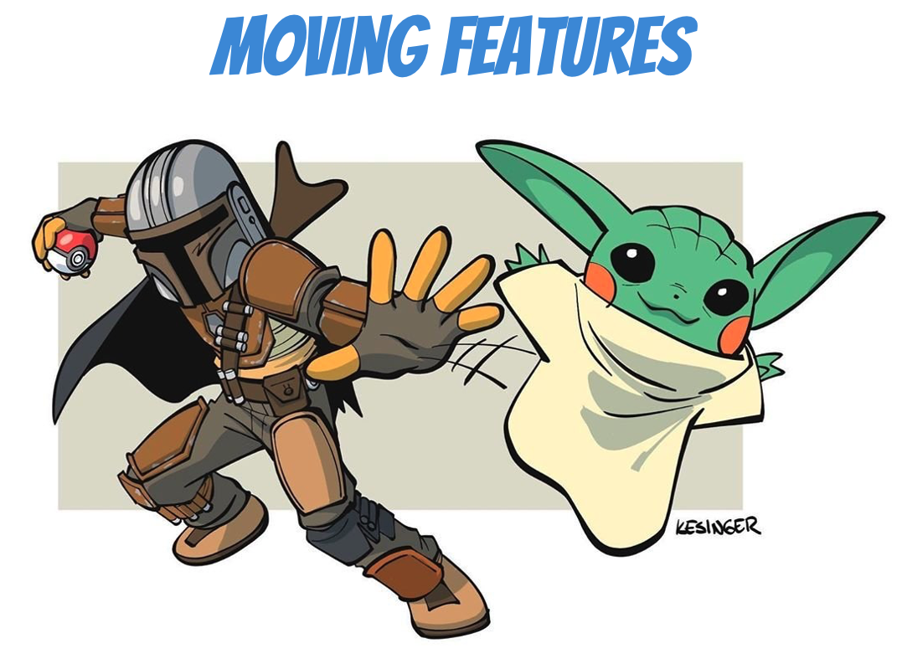
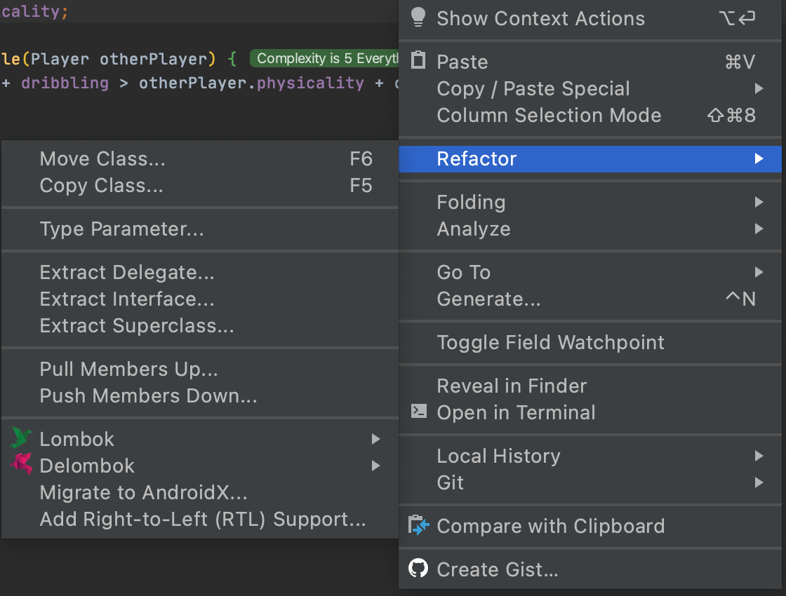
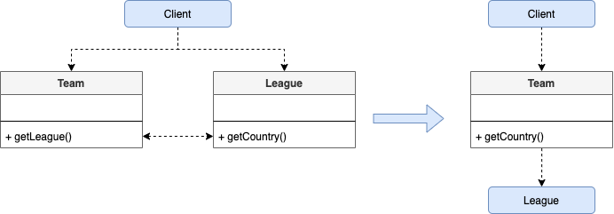
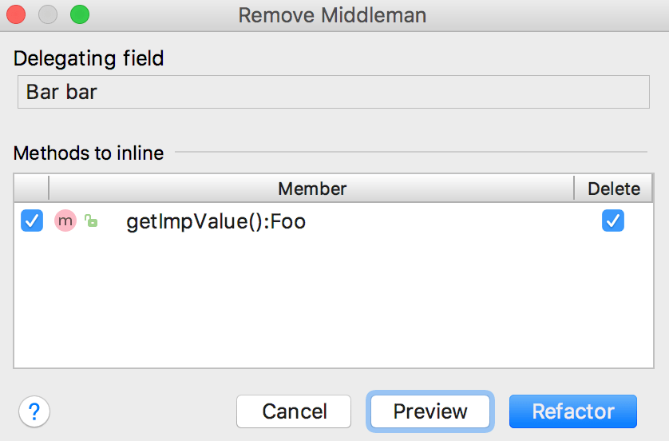

## Extract Class
### Code Smells
* A class is doing the work of several

### Technique
* Create a new class
* Place the fields / methods responsible for the related functionality in it

### Practice
* Open `Player` in `moving.features` package
* Extract "*attributes*" into a new class 

### Shortcuts
* Right Click in the file
* Refactor | Extract Delegate

* Then configure the extraction
* More info [here](https://www.jetbrains.com/help/idea/extract-into-class-refactorings.html#extract_delegate)

### Benefits
* Maintain adherence to the Single Responsibility Principle

### Drawbacks
* Could create a lot of (Inline) classes

## Hide Delegate
### Code Smells
* [Law of Demeter](https://en.wikipedia.org/wiki/Law_of_Demeter) : call chain appears when a client requests an object from another object, then the second object requests another one, and so on. 
    * Stuff like : *person.getFirstAccount().getLastWithdrawal().getAmount()*
> Any changes in these interrelationships will require changes on the client side.

### Technique
For each method of the delegate-class called by the client
* Create a method in the `server-class that delegates the call to the delegate-class
* Change the `client` code so that it calls the methods of the server-class

### Practice
* Open `ChampionsLeague` in `moving.features` package
* Hide Delegate

### Benefits
* Hides delegation from the client
   * Make it easier to make changes to the system

### Drawbacks
* Could lead to an excess of Middle Man

## Remove Middle Man
### Code Smells
* A class has too many methods that delegates to other objects

### Technique
* Create a getter for accessing the delegate(s)
* Replace calls to delegating methods in the server-class

### Practice
* Remove the Middle Man introduced in the previous exercise

### Shortcuts
* Open the class in the editor, and position the caret at the name of the delegating field
* On the main or context menu, select Refactor | Remove Middleman in Intellij

* More info [here](https://www.jetbrains.com/help/idea/remove-middleman.html)

### Drawbacks
* Bound objects together