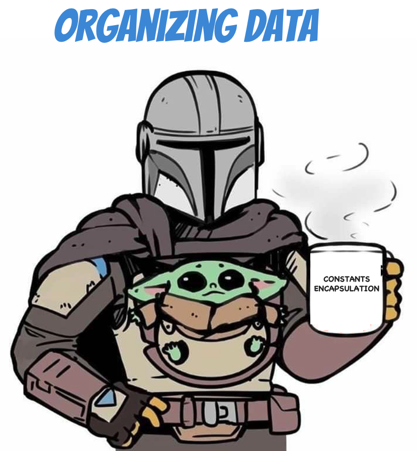

## Replace Magic Stuff with Constants
### Code Smells
* Code uses `numbers` that have a certain meaning to it
* Code uses `strings` that have a certain meaning to it

Make it harder to understand the program and refactor the code

### Technique
* Extract the magic stuff by using your IDE feature
  * Makes its name self-evident

### Practice
* Open `Wizard` in `organizing.data` package
* Extract magic stuff

### Shortcuts
| IntelliJ |
|---|
| Ctrl+Alt+C |
| ⌘+⌥+C |

### Benefits
* Symbolic constant can serve as live documentation of the meaning of its value
* Reduce duplicate use of a number in the code

### Drawbacks
* N/A

## Encapsulate fields
### Code Smells
* From public to private fields
* Ideally expose just behaviors (methods / functions)

One of the pillars of object-oriented programming is Encapsulation : the ability to conceal object data.

### Technique
* Extract the magic stuff by using your IDE feature
  * Makes its name self-evident

### Practice
* Open `Wizard` in `organizing.data` package
* Extract magic stuff

### Shortcuts
* Right Click in the file
* Refactor | Encapsulate Fields

* Then configure the encapsulation
* More info [here](https://www.jetbrains.com/help/idea/encapsulate-fields.html)

### Benefits
* Preserve the state of your object
    * No side effect from the outside
* Much easier for you to maintain and develop this component

### Drawbacks
* N/A