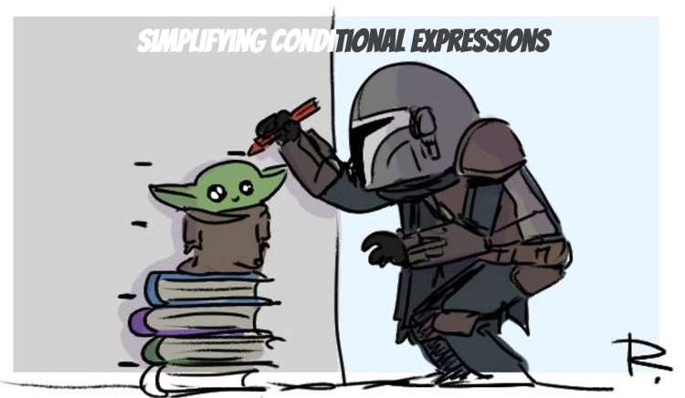

## Consolidate Conditional Expression
### Code Smells
* Multiple conditionals that lead to the same result or action

### Technique
* Consolidate the conditionals in a single expression by using AND and OR As a general rule when consolidating
* Perform Extract Method on the operator conditions and give the method a name that reflects the expression’s purpose

### Practice
* Open `AuthorizationService` in `simplifying.conditional.expressions` package
* Simplify if else

`Before touching this kind of code always check the Code Coverage`

### Benefits
* Eliminates duplicate control flow code
    * More readable code  
* By consolidating all operators
    * Isolate the complex expression in a method with a name that explains the conditional’s purpose

### Drawbacks
* N/A

BONUS : what do you think about the tests ?
`Would you favor mocks over instantiating concrete objects ?`