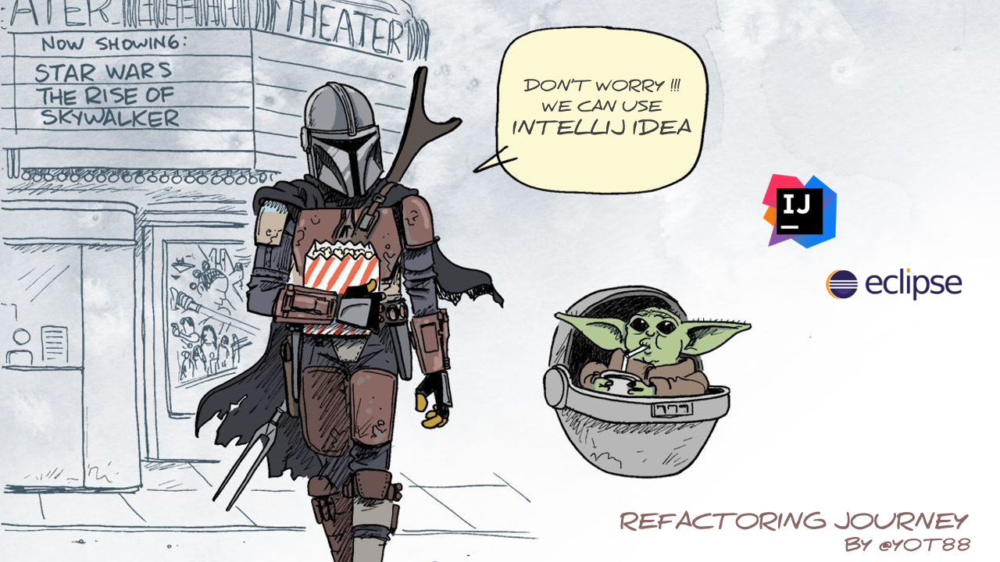

# Refactoring journey

* Clone the repository

`Lazy you will be`-> use your IDE
* [Intellij shortcuts](https://resources.jetbrains.com/storage/products/intellij-idea/docs/IntelliJIDEA_ReferenceCard.pdf)
* [Eclipse shortcuts](https://www.eclipse.org/getting_started/content/eclipse-ide-keybindings.pdf)

## Don't forget the Golden Rule 
Before any changes :
* Check the tests
* Make sure they are all Green

Follow the links to go on the detailed exercises :
### [1) Composing method](1-composing-method.md)
### [2) Moving features](2-moving-features.md)
### [3) Organizing data](3-organizing-data.md)
### [4) Simplifying Conditional Expressions](4-simplifying-conditional-expressions.md)