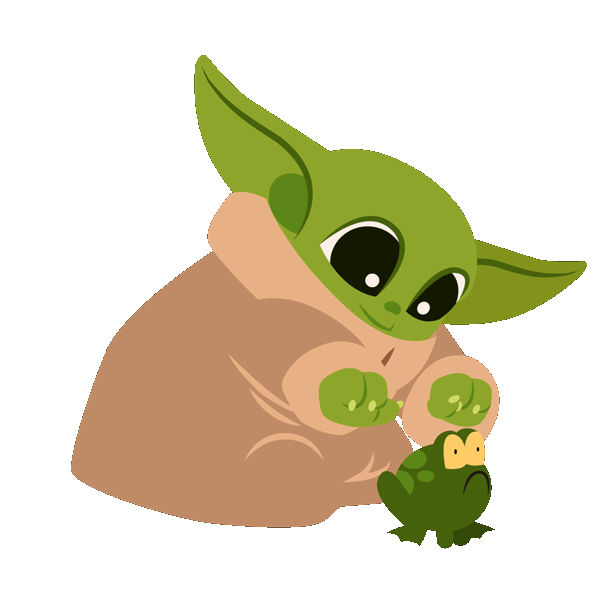

    <link rel="stylesheet" type="text/css" href="css/konami.css">
    
    
    

# Refactoring journey

* Clone the [repository](https://github.com/ythirion/refactoring-journey)

`Lazy you will be`-> use your IDE
* [Intellij shortcuts](https://resources.jetbrains.com/storage/products/intellij-idea/docs/IntelliJIDEA_ReferenceCard.pdf)
* [Eclipse shortcuts](https://www.eclipse.org/getting_started/content/eclipse-ide-keybindings.pdf)

## Don't forget the Golden Rule 
Before any changes :
* Check the tests
* Make sure they are all Green

> I strongly advise to use the Split Feature of your IDE to organize your work :  

>