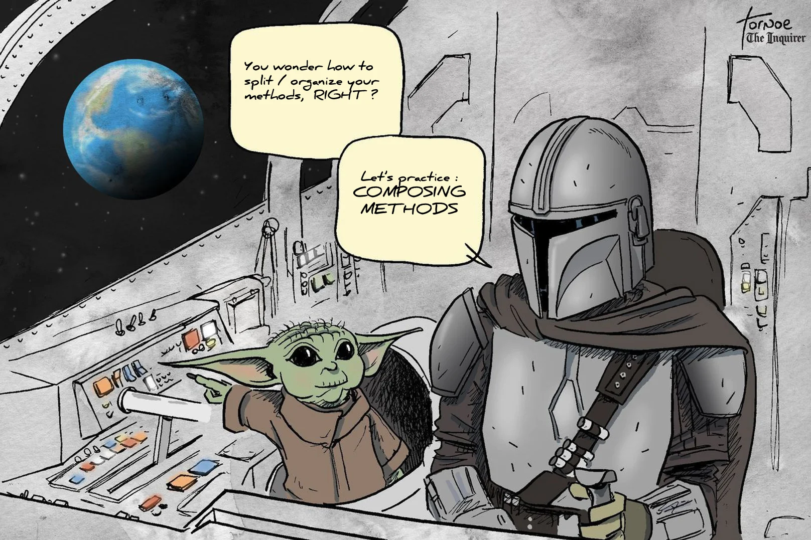
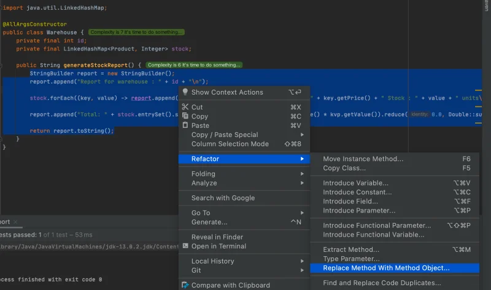

<details open markdown="block">
  <summary>
    Table of contents
  </summary>
  {: .text-delta }
1. TOC
{:toc}
</details>

## Extract Method
### Code Smells
{: .no_toc}
* Too many responsibilities in a single method
* Method that breaks the single responsibility principle
* Long methods
* Comments on part of the method
* `And` in the method name

### Technique
{: .no_toc}
* Extract the new method by using your IDE feature
    * Makes its purpose self-evident
* Be careful with the needed variables before extracting otherwise you will have to move them by yourself

### Practice 1
{: .no_toc}
* Open `Order` in `composing.methods` package
* Extract methods to improve readability / reduce complexity

### Practice 2
{: .no_toc}
* Open `AmountCalculator` in `composing.methods` package
* Extract methods to remove code duplication
* `The power of your IDE you will use`
    * Start by trying to extract this piece of code
    ```java
              double discountBasedOnAge = 0;
              if (age <= 16) {
                  discountBasedOnAge = 0.35 * result;
              } else if (age >= 60) {
                  discountBasedOnAge = 0.2 * result;
              }
 
### Shortcuts
{: .no_toc}
Extract method :

| IntelliJ | Eclipse |
|---|---|
| Ctrl+Alt+M | Alt+Shift+M |
| ⌘+⌥+M | ⌥+⌘+M |

### Benefits
{: .no_toc}
* More readable code
* Avoid code duplication

## Extract variable
### Code Smells
{: .no_toc}
* Hard to understand expressions

### Technique
{: .no_toc}
* Place the result of the expression or its parts in separate variables that are self-explanatory.

### Practice
{: .no_toc}
* Open `Food` in `composing.methods` package
* Extract variables from the `isEdible` method

### Shortcuts
{: .no_toc}
Extract Variable :

| IntelliJ | Eclipse |
|---|---|
| Ctrl+Alt+V | Alt+Shift+L |
| ⌘+⌥+V | ⌥+⌘+L |

### Benefits
{: .no_toc}
More readable code

### Drawbacks
{: .no_toc}
* More variables
* Performance
    * Expressions will always be called

## Inline Temp
### Code Smells
{: .no_toc}
* Temporary variable assigning the result of a simple expression
    * And nothing more

### Technique
{: .no_toc}
* Replace the references to the variable with the expression itself

### Practice 1
{: .no_toc}
* Open `OrderHelper` in `composing.methods` package
* Replace the price reference with the expression itself

### Practice 2
{: .no_toc}
* Refactor the `deserveDiscountBasedOnCustomer` by using previous learnings

`Faker library (or alternatives) can really help you save a lot of time when needing data for your tests.` 

### Benefits
{: .no_toc}
* Less code
* Less noise

## Remove Assignments to Parameters
### Code Smells
{: .no_toc}
* A value is assigned to a parameter inside method’s body

### Technique
{: .no_toc}
* Use a local variable instead of a parameter.

### Practice 1
{: .no_toc}
* Open `OrderHelper` in `composing.methods` package  
* Reflect on the method
    * Its signature
    * Which concept does it break ?
* Add a new test for the `calculateNewStock` method

### Practice 2
{: .no_toc}
* Refactor the `calculateNewStock` into a Pure Function

### Benefits
{: .no_toc}
* Avoid side effects
* Create pure functions
    * Easier to maintain / test
    
## Replace long method with Method Object (composition)
### Code Smells
{: .no_toc}
* Long methods : local variables are so intertwined that you can’t apply *Extract Method*
* Break often Single Responsibility Principle

### Technique
{: .no_toc}
* Transform the method into a separate class
    * Local variables become fields of the class
* Split the method into several methods within the same class

### Practice
{: .no_toc}
* Open `Warehouse` in `composing.methods` package  
* Extract the content of the `generateStockReport` method in a `StockReportGenerator` class
* Inject the Warehouse instance to it
* Refactor the code until you are happy with it
* What are the side effects on the consumers of the Warehouse class ?

### Shortcuts
{: .no_toc}
* With IntelliJ select the content of the `generateStockReport` method
* Go into your **Refactor** menu and select **Replace Method with Method Object...**

* More info [here](https://www.jetbrains.com/help/idea/extract-into-class-refactorings.html#extract_method_object)

### Benefits
{: .no_toc}
* Stop a method from growing

### Drawbacks
{: .no_toc}
* Another class is added
* Increase the overall complexity of the program