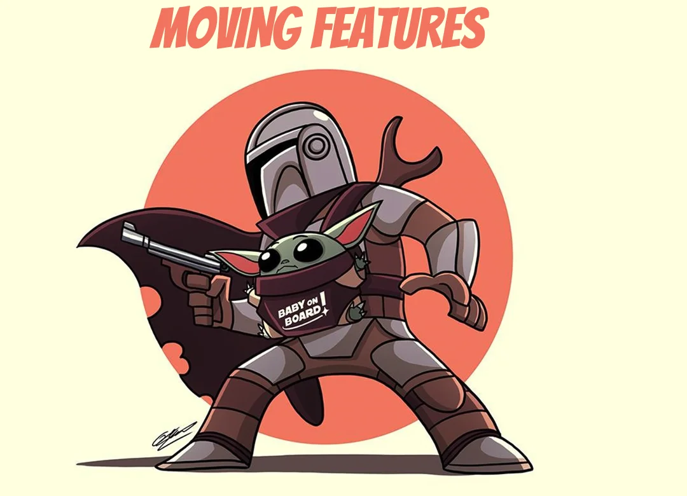

<details open markdown="block">
  <summary>
    Table of contents
  </summary>
  {: .text-delta }
1. TOC
{:toc}
</details>

## Extract Class
### Code Smells
{: .no_toc}
* A class is doing the work of several

### Technique
{: .no_toc}
* Create a new class
* Place the fields / methods responsible for the related functionality in it

### Practice
{: .no_toc}
* Open `Player` in `moving.features` package
* Extract "*attributes*" into a new class

```java
@AllArgsConstructor
@Getter
@Builder
public class Player {
    private final String firstName;
    private final String lastName;
    private final LocalDate birthDate;
    private final int height;
    private final int weight;
    private final int rating;
    private final int pace;
    private final int shooting;
    private final int passing;
    private final int dribbling;
    private final int defending;
    private final int physicality;

    public boolean canDribble(Player otherPlayer) {
        return physicality + dribbling > otherPlayer.physicality + otherPlayer.defending;
    }
}
```

### Shortcuts
{: .no_toc}
* Right Click in the file
* ` Refactor | Extract Delegate`

* Then configure the extraction
* More info [here](https://www.jetbrains.com/help/idea/extract-into-class-refactorings.html#extract_delegate)

### Benefits
{: .no_toc}
* Maintain adherence to the Single Responsibility Principle

### Drawbacks
{: .no_toc}
* Could create a lot of (Inline) classes

## Hide Delegate
### Code Smells
{: .no_toc}
* [Law of Demeter](https://en.wikipedia.org/wiki/Law_of_Demeter) : call chain appears when a client requests an object from another object, then the second object requests another one, and so on. 
    * Stuff like : *person.getFirstAccount().getLastWithdrawal().getAmount()*
> Any changes in these interrelationships will require changes on the client side.

### Technique
{: .no_toc}
For each method of the delegate-class called by the client
* Create a method in the `server-class that delegates the call to the delegate-class
* Change the `client` code so that it calls the methods of the server-class

### Practice
{: .no_toc}
* Open `ChampionsLeague` in `moving.features` package
* Hide Delegate

```java
@AllArgsConstructor
@Getter
public class ChampionsLeague {
    private final List<Team> teams;

    public String nextStageTable() {
        return teams.stream()
                .map(team -> team.getName() + " - " + team.getLeague().getCountry())
                .collect(Collectors.joining("%n"));
    }
}
```


### Benefits
{: .no_toc}
* Hides delegation from the client
   * Make it easier to make changes to the system

### Drawbacks
{: .no_toc}
* Could lead to an excess of Middle Man

## Remove Middle Man
### Code Smells
{: .no_toc}
* A class has too many methods that delegates to other objects

### Technique
{: .no_toc}
* Create a getter for accessing the delegate(s)
* Replace calls to delegating methods in the server-class

### Practice
{: .no_toc}
* Remove the Middle Man introduced in the previous exercise (in `ChampionsLeague`)

### Shortcuts
{: .no_toc}
* Open the class in the editor, and position the caret at the name of the delegating field
* On the main or context menu, select `Refactor | Remove Middleman` in Intellij


* More info [here](https://www.jetbrains.com/help/idea/remove-middleman.html)

### Drawbacks
{: .no_toc}
* Bound objects together