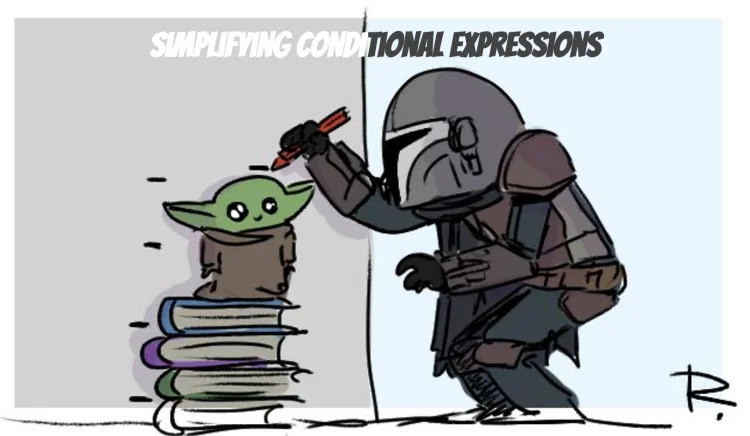
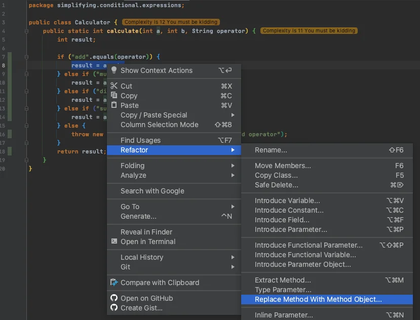

<details open markdown="block">
  <summary>
    Table of contents
  </summary>
  {: .text-delta }
1. TOC
{:toc}
</details>

## Consolidate Conditional Expression
### Code Smells
{: .no_toc}
* Multiple conditionals that lead to the same result or action

### Technique
{: .no_toc}
* Consolidate the conditionals in a single expression by using AND and OR As a general rule when consolidating
* Perform Extract Method on the operator conditions and give the method a name that reflects the expression’s purpose

### Practice
{: .no_toc}
* Open `AuthorizationService` in `simplifying.conditional.expressions` package
* Simplify if else

```java
public class AuthorizationService {
    public boolean isAuthorized(User user, String action) {
        if (action == null) {
            return false;
        }
        if (action.equals("")) {
            return false;
        }
        if (user.getAge() < 18) {
            return false;
        }
        if (user.isDisabled()) {
            return false;
        }
        if (!user.isLoyal()) {
            return false;
        }
        return true;
    }
}
```

`Before touching this kind of code always check the Code Coverage`
* Let's cover the missing branch
* Only then simplify if else

### Benefits
{: .no_toc}
* Eliminates duplicate control flow code
    * More readable code  
* By consolidating all operators
    * Isolate the complex expression in a method with a name that explains the conditional’s purpose

### Drawbacks
{: .no_toc}
* N/A

`BONUS : what do you think about the tests ?  / Would you favor mocks over instantiating concrete objects ?`

## Consolidate Duplicate Conditional Fragments
### Code Smells
{: .no_toc}
* Identical code in all branches of a conditional

### Technique
{: .no_toc}
* Move the code outside of the conditional :
    * If the duplicated code is `at the beginning` of the conditional branches
        * Move the code to a place before the conditional
    * If the code is `at the end` of the branches
        * Place it after the conditional
    * If the duplicate code is `randomly located`  inside the branches
        * First try to move the code to the beginning or end of the branch
        * Depending on whether it changes the result of the subsequent code
* If appropriate, and the duplicate code is longer than one line, try using Extract Method.

### Practice
{: .no_toc}
* Open `PriceCalculator` in `simplifying.conditional.expressions` package
* Remove duplicate code by using your IDE

```java
@AllArgsConstructor
public class PriceCalculator {
    private final boolean isSaleDay;

    public double calculatePrice(double price) {
        double total;

        if (isSaleDay) {
            total = price * 0.5;
            notifySales(total);
        } else {
            total = price * 0.98;
            notifySales(total);
        }
        return total;
    }

    private void notifySales(double amount) {

    }
}

```

### Shortcuts
{: .no_toc}
* Put your cursor on the if line and use this shortcut (`Show intention actions and quick-fixes`)

| IntelliJ |
|---|
| Alt+Enter |
| ⌥+↩ |

### Benefits
{: .no_toc}
* Code deduplication

### Drawbacks
{: .no_toc}
* N/A

## Decompose Conditional
### Code Smells
{: .no_toc}
* Complex conditional 
    * `if...else`
    * `switch`
* The longer a piece of code is the harder it is to understand.

### Technique
{: .no_toc}
* Decompose the complicated parts of the conditional into separated methods :
    * The condition : then and else
    * Use your `Extract Method` feature
* Repeat the process for each block

### Practice
{: .no_toc}
* Open `RoomPriceCalculator` in `simplifying.conditional.expressions` package
* Decompose conditional by extracting methods

```java
@AllArgsConstructor
public class RoomPriceCalculator {
    private static final LocalDate HIGH_SEASON_START_DATE = LocalDate.of(LocalDate.now().getYear(), 6, 30);
    private static final LocalDate HIGH_SEASON_END_DATE = LocalDate.of(LocalDate.now().getYear(), 10, 31);

    private final LocalDate today;
    private final double regularPrice;
    private final double highSeasonRate;
    private final double lowSeasonRate;
    private final double lowSeasonExtraCharge;

    public double calculatePriceFor(int numberOfRooms,
                                    LocalDate selectedDate) {
        double price;

        if (selectedDate.isAfter(today) && (selectedDate.isBefore(HIGH_SEASON_START_DATE) || selectedDate.isAfter(HIGH_SEASON_END_DATE))) {
            if (numberOfRooms <= 0) {
                throw new IllegalArgumentException("Invalid Number of Rooms");
            }
            price = numberOfRooms * regularPrice * lowSeasonRate + lowSeasonExtraCharge;
        } else if (selectedDate.isAfter(today)) {
            price = numberOfRooms * regularPrice * highSeasonRate;

            if (numberOfRooms <= 0) {
                throw new IllegalArgumentException("Invalid Number of Rooms");
            }
        } else {
            throw new IllegalArgumentException("Selected date should be in the future");
        }
        return price;
    }
}
```

### Shortcuts
{: .no_toc}
Extract method :

| IntelliJ | Eclipse |
|---|---|
| Ctrl+Alt+M | Alt+Shift+M |
| ⌘+⌥+M | ⌥+⌘+M |

### Benefits
{: .no_toc}
* More maintainable / understandable code

### Drawbacks
{: .no_toc}
* N/A

## Replace Conditional with Polymorphism
### Code Smells
{: .no_toc}
* Conditional which performs various actions depending on object type or properties

### Technique
{: .no_toc}
* Create subclasses matching the branches of the conditional
* Create a shared method and move code from the corresponding branch of the conditional to it
* Then replace the conditional with the relevant method calls

### Practice
{: .no_toc}
* Open `Calculator` in `simplifying.conditional.expressions` package
* Extract behaviors into class hierarchies

```java
public class Calculator {
    public static int calculate(int a, int b, String operator) {
        int result;

        if ("add".equals(operator)) {
            result = a + b;
        } else if ("multiply".equals(operator)) {
            result = a * b;
        } else if ("divide".equals(operator)) {
            result = a / b;
        } else if ("subtract".equals(operator)) {
            result = a - b;
        } else {
            throw new IllegalArgumentException("Not supported operator");
        }
        return result;
    }
}
```

### Shortcuts
{: .no_toc}
Replace Method with Method Object by using `Refactor | Replace Method with Method Object` menu in IntelliJ



### Benefits
{: .no_toc}
* If you need to add a new execution variant
    * All you need to do is add a new subclass without touching the existing code (Open/Closed Principle)
* Adheres to the Tell-Don’t-Ask principle :
    * Instead of asking an object about its state and then performing actions based on this
    * Much easier to simply tell the object what it needs to do and let it decide for itself how to do that

### Drawbacks
{: .no_toc}
* N/A