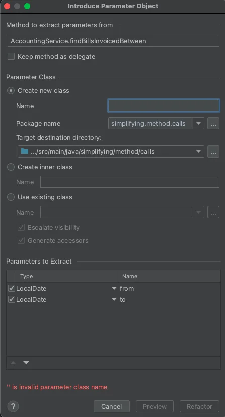

<details open markdown="block">
  <summary>
    Table of contents
  </summary>
  {: .text-delta }
1. TOC
{:toc}
</details>

## Rename method
### Code Smells
{: .no_toc}
* The name of a method does not explain what the method does

### Technique
{: .no_toc}
* Use the "Rename" functionality of your IDE
* It will fix each calls for you

### Practice
{: .no_toc}
* Open `Employee` in `simplifying.method.calls` package
* Rename every method with a "shitty" name

```java
public class Employee {
    private final String id;
    private final String name;
    private final String role;
    private final String currentProject;
    private final List<String> skills;

    public Employee(String name, String role, String currentProject, List<String> basicSkills) {
        this.id = UUID.randomUUID().toString();
        this.name = name;
        this.role = role;
        this.currentProject = currentProject;
        this.skills = basicSkills;
    }

    public String get() {
        return id;
    }

    public String getN() {
        return name;
    }

    public String getR() {
        return role;
    }

    public String getP() {
        return currentProject;
    }

    public boolean isProfessionalService() {
        return !getR().equals("Assoc");
    }

    public boolean isIdeal() {
        return getP().equals("Beach") || getP().isEmpty();
    }

    public boolean hasSomething(String skill) {
        return this.skills.contains(skill);
    }
}
```

### Shortcuts
{: .no_toc}
Rename : `can be used to rename anything`

| IntelliJ | Eclipse |
|---|---|
| Shift+F6 | Alt+Shift+R |
| ⇧+F6 | ⌥+⌘+R |

### Benefits
{: .no_toc}
* Improved code readability

### Drawbacks
{: .no_toc}
* N/A

## Remove Dead Parameter
### Code Smells
{: .no_toc}
* A parameter isn’t used in the body of a method
* Every parameter in a method call forces the programmer reading it to figure out what information is in this parameter
* Additional parameters are extra code that has to be run

### Technique
{: .no_toc}
* Use the "Rename" functionality of your IDE
* It will fix each calls for you

### Practice
{: .no_toc}
* Open `Lottery` in `simplifying.method.calls` package
* Remove safely every Dead parameter

> Don't forget to clean the tests as well

```java
public class Lottery {
    private static final Random RANDOM = new Random(42);
    private final HashMap<UUID, LotteryTicket> tickets = new HashMap<>();

    public String purchaseTicketForCustomer(UUID id, String name) {
        String ticketNumber = generateTicketNumber(null);
        tickets.put(id, new LotteryTicket(ticketNumber, id));

        return ticketNumber;
    }

    public LotteryTicket drawWinner(double ticketPrice, double prizeAmount) {
        if (tickets.isEmpty()) {
            throw new IllegalStateException("No tickets");
        }

        List<LotteryTicket> randomizedTickets = new ArrayList<>(tickets.values());
        Collections.shuffle(randomizedTickets);

        return randomizedTickets.get(0);
    }

    private String generateTicketNumber(String format) {
        return String.format("%06d", RANDOM.nextInt(1000000));
    }
}
```

### Shortcuts
{: .no_toc}
* Use `Safe Delete` feature in your IDE

| IntelliJ |
|---|
| Alt+Delete |
| ⌘+Delete |

### Benefits
{: .no_toc}
* A method contains only the parameters that it truly requires
* More understandable code

### Drawbacks
{: .no_toc}
* N/A

## Separate Query from Modifier
### Code Smells
{: .no_toc}
* Method that returns a value but also changes the internal state of an object
* Have an `and` in your method names

Always remind this sentence : `asking a question should not change the answer`  
To know more read about [Command-query separation](https://en.wikipedia.org/wiki/Command%E2%80%93query_separation)

### Technique
{: .no_toc}
* Split the method into two separate methods
* As you would expect :
    * One of them should return the value 
    * The other one modifies the object
    
### Practice
{: .no_toc}
* Open `Client` in `simplifying.method.calls` package
* Apply the technique explained

```java
public class Client {
    private final HashMap<String, Double> orderLines;
    @Getter
    private double totalAmount;

    public Client(HashMap<String, Double> orderLines) {
        this.orderLines = orderLines;
    }

    public String toStatement() {
        return orderLines.entrySet().stream()
                .map(entry -> formatLine(entry.getKey(), entry.getValue()))
                .collect(Collectors.joining("%n"))
                .concat("%nTotal : " + totalAmount + "€");
    }

    private String formatLine(String name, Double value) {
        totalAmount += value;
        return name + " for " + value + "€";
    }
}

```

### Shortcuts
{: .no_toc}
Extract method :

| IntelliJ | Eclipse |
|---|---|
| Ctrl+Alt+M | Alt+Shift+M |
| ⌘+⌥+M | ⌥+⌘+M |

### Benefits
{: .no_toc}
* Avoid side effects in your programs

### Drawbacks
{: .no_toc}
* N/A

## Introduce Parameter Object
### Code Smells
{: .no_toc}
* Methods contain a repeating group of parameters

### Technique
{: .no_toc}
* Replace these parameters with an object
* Create a new immutable class representing the group of parameters
* In all method calls, pass the object created from old method parameters to this parameter
    
### Practice
{: .no_toc}
* Open `AccountingService` in `simplifying.method.calls` package
* Apply the technique explained

```java
@AllArgsConstructor
public class AccountingService {
    private final List<Bill> bills;

    public ArrayList<Bill> findBillsInvoicedBetween(LocalDate from, LocalDate to) {
        return findBills(Bill::getInvoicedDate, from, to);
    }

    public ArrayList<Bill> findBillsDueBetween(LocalDate from, LocalDate to) {
        return findBills(Bill::getDueDate, from, to);
    }

    public ArrayList<Bill> findBillsPaidBetween(LocalDate from, LocalDate to) {
        return findBills(Bill::getPaymentDate, from, to);
    }

    private ArrayList<Bill> findBills(Function<Bill, LocalDate> dateSelector, LocalDate from, LocalDate to) {
        return bills.stream()
                .filter(bill -> isInRange(dateSelector.apply(bill), from, to))
                .collect(Collectors.toCollection(ArrayList::new));
    }

    private boolean isInRange(LocalDate dateToCheck, LocalDate from, LocalDate to) {
        return dateToCheck != null &&
                (dateToCheck.isAfter(from) || dateToCheck.isEqual(from)) && (dateToCheck.isBefore(to) || dateToCheck.isEqual(to));
    }
}
```

### Shortcuts
{: .no_toc}
* Right Click on the Method name
* `Refactor | Introduce Parameter Object`



* Find & Replace in the current file :

| IntelliJ |
|---|
| Ctrl+R |
| ⌘+R |

### Benefits
{: .no_toc}
* Instead of a lot of parameters
    * You see a single object with a comprehensible name

### Drawbacks
{: .no_toc}
* N/A

`BONUS : Add a minimumAmount parameter to each find method and change the code accordingly`

## Use Factory or Factory Methods
### Code Smells
{: .no_toc}
* Complex constructor that does something more than just setting parameter values in object fields

### Technique
{: .no_toc}
* Create a factory method and use it to replace constructor calls.

### Practice
{: .no_toc}
* Open `Notification` in `simplifying.method.calls` package
* Create a Factory Method for `Notification`

```java
public class Notification {
    private static List<String> authorizedChannels = List.of("SMS", "EMAIL", "PUSH");
    private final String channel;

    public Notification(String channel) {
        if (channel == null
                || channel.isEmpty()
                || !authorizedChannels.contains(channel)) {
            throw new IllegalArgumentException("Invalid channel provided");
        }
        this.channel = channel;
    }
}
```

### Shortcuts
{: .no_toc}
* Select the constructor code
* Use the menu `Refactor | Replace Constructor With Factory Method.`

### Benefits
{: .no_toc}
* Force instantiation through Factory responsible for creation rules

### Drawbacks
{: .no_toc}
* N/A
