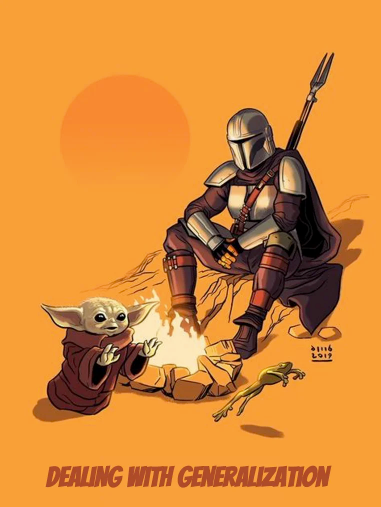

  

    Table of contents
  

  {: .text-delta }
1. TOC
{:toc}

## Extract Superclass
### Code Smells
{: .no_toc}
* 

### Technique
{: .no_toc}
* 

### Practice
{: .no_toc}
* Open `Employee` in `simplifying.method.calls` package
* Rename every method with a "shitty" name

### Shortcuts
{: .no_toc}
???

| IntelliJ | Eclipse |
|---|---|
| Shift+F6 | Alt+Shift+R |
| ⇧+F6 | ⌥+⌘+R |

### Benefits
{: .no_toc}
* 

### Drawbacks
{: .no_toc}
* N/A