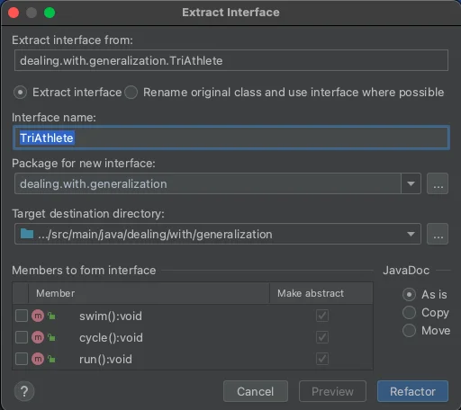

<details open markdown="block">
  <summary>
    Table of contents
  </summary>
  {: .text-delta }
1. TOC
{:toc}
</details>

## Pull Up Method or Fields
### Code Smells
{: .no_toc}
* Several classes have the same fields / methods
* Objects offer a built-in mechanism for simplifying such situations through inheritance

`Sometimes this similarity remains unnoticed until classes have been created : an inheritance structure will be created later.`

### Technique
{: .no_toc}  
`Remove the fields / methods from subclasses and move it to the superclass`
* Make sure fields / methods are used for the same needs in subclasses
* If the fields have different names :
    * Give them the same name and replace all references to the fields in existing code
    * Create a field with the same name in the superclass 
* Note that if the fields/methods were private, the superclass field should be protected
* Remove the fields/methods from the subclasses

### Practice
{: .no_toc}
* Open `Event` in `dealing.with.generalization` package
* Pull Up everything that needs to be pulled from children classes

```java
package dealing.with.generalization;

public class Concert extends Event {
    private boolean running;
    private long startTime = 0;
    private long stopTime = 0;
    private int volume = 30;

    private final String description;

    public Concert(String description) {
        this.description = description;
    }

    public void start() {
        if (running) {
            throw new IllegalStateException("Concert is already in progress");
        }
        this.startTime = System.currentTimeMillis();
        running = true;
    }

    public void stop() {
        if (running) {
            running = false;
            stopTime = System.currentTimeMillis();
        }
    }

    public long getElapsedTime() {
        return running ? (System.currentTimeMillis() - startTime) : (stopTime - startTime);
    }

    public void volumeUp(int increase) {
        this.volume += increase;
    }

    public void volumeDown(int decrease) {
        this.volume -= decrease;
    }
}

public class TheaterPiece extends Event {
    private boolean running;
    private long startTime = 0;
    private long stopTime = 0;

    private final String description;
    private final int numberOfActors;

    public TheaterPiece(String description, int numberOfActors) {
        this.description = description;
        this.numberOfActors = numberOfActors;
    }

    public void start() {
        if (running) {
            throw new IllegalStateException("Concert is already in progress");
        }
        this.startTime = System.currentTimeMillis();
        running = true;
    }

    public void end() {
        if (running) {
            running = false;
            stopTime = System.currentTimeMillis();
        }
    }

    public long calculateElapsedTimes() {
        return running ? (System.currentTimeMillis() - startTime) : (stopTime - startTime);
    }
}
```

### Shortcuts
{: .no_toc}
* Highlight *stuff* you want to pull up then :
* Then Right Click
* Select `Refactor | Pull members Up`
* Select everything you want to pull


* More info [here](https://www.jetbrains.com/help/idea/pull-members-up.html)

### Benefits
{: .no_toc}
* Eliminates duplication
* More cohesive classes

### Drawbacks
{: .no_toc}
N/A

## Extract Superclass
### Code Smells
{: .no_toc}
* Several classes with common fields and methods/behaviors
* Objects offer a built-in mechanism for simplifying such situations through inheritance

> Sometimes this similarity remains unnoticed until classes have been created : an inheritance structure will be created later.

### Technique
{: .no_toc}
* Create an abstract superclass
* Use **Pull Up Field**, **Pull Up Method**, and **Pull Up** constructor Body to move the common functionality to a superclass
* Start with the fields
    * Since in addition to the common fields : you will need to move the fields that are used in the common methods
* Look for places in the client code where use of subclasses can be replaced with your new class (such as in type declarations)

### Practice
{: .no_toc}
* Open `Customer` and `Prospect` in `dealing.with.generalization` package
* Create a base Superclass

```java
@AllArgsConstructor
public class Customer {
    private final String name;
    private final String email;
    private final String phone;
    private final LocalDate creationDate;
    private final LocalDate conversionDate;
    private final List<String> messages;
}

@AllArgsConstructor
public class Prospect {
    private final String name;
    private final String email;
    private final String phone;
    private final LocalDate creationDate;
    private final List<String> messages;
}
```

### Shortcuts
{: .no_toc}
* Right Click in the file
* Select `Refactor | Extract Superclass`
* Follow the instructions


* More info [here](https://www.jetbrains.com/help/idea/extract-superclass.html)

### Benefits
{: .no_toc}
* Code deduplication
* Common fields and methods now *live* in only one place

### Drawbacks
{: .no_toc}
* Cannot apply this technique to classes that already have a superclass

## Extract Interface
### Code Smells
{: .no_toc}
* Multiple classes are using the same part of a class interface
* Part of the interface in two classes is the same

### Technique
{: .no_toc}
* Create an empty interface
* Declare common operations in the interface
* Declare the necessary classes as implementing the interface
* Change type declarations in the client code to use the new interface/abstraction

> Extracting an interface allows isolating only common interfaces, not common code. 
> If classes contain Duplicate Code, extracting the interface won’t help you to deduplicate.

### Practice
{: .no_toc}
* Open `TriAthlete` and `JumpyAthlete` in `dealing.with.generalization` package
* Extract a common Interface
* Use this new Interface in the client code (tests)

```java
@AllArgsConstructor
public class TriAthlete {
    private final String name;

    public void swim() {
        System.out.println(name + " started swimming");
    }

    public void cycle() {
        System.out.println(name + " started cycling");
    }

    public void run() {
        System.out.println(name + " started running");
    }
}

@AllArgsConstructor
public class JumpyAthlete {
    private final String name;

    public void swim() {
        System.out.println(name + " started swimming");
    }

    public void cycle() {
        System.out.println(name + " started cycling");
    }

    public void run() {
        System.out.println(name + " started running");
    }

    public void jump() {
        System.out.println(name + " is skydiving");
    }
}
```

### Shortcuts
{: .no_toc}
* Right Click in the file
* Select `Refactor | Extract Interface`
* Follow the instructions


* More info [here](https://www.jetbrains.com/help/idea/extract-interface.html)

### Benefits
{: .no_toc}
* More explicit code
* Small interfaces (check Interface Segregation Principle from [S.O.L.I.D Principles](https://yoan-thirion.gitbook.io/knowledge-base/software-craftsmanship/code-katas/write-s.o.l.i.d-code))

### Drawbacks
{: .no_toc}
N/A

`BONUS : Use default interface to refactor this code`