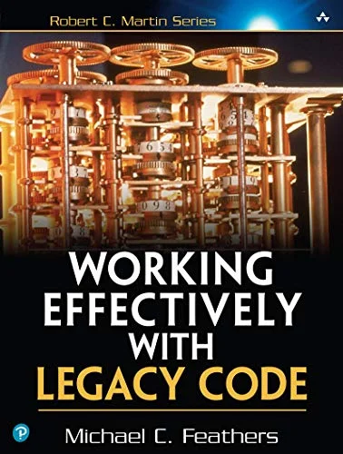
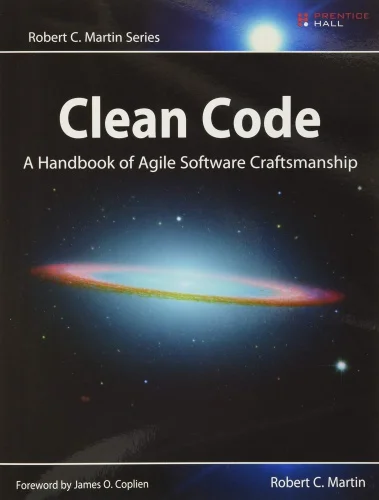
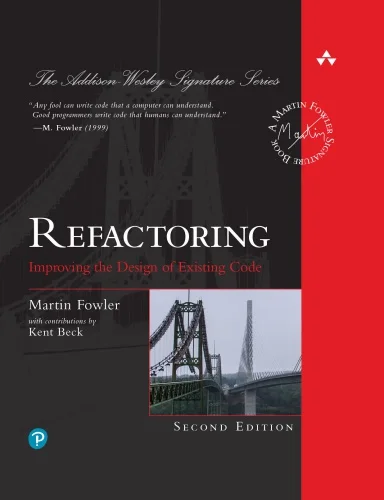
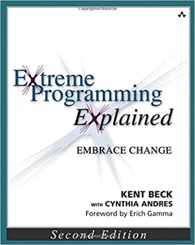
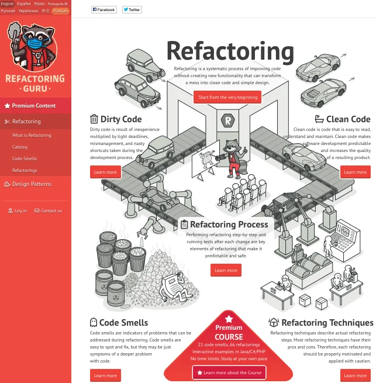
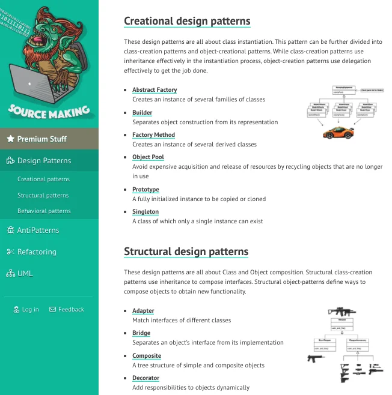

## Must Read Books
| Working effectively with Legacy Code  |  | Clean Code  |   |
|  Refactoring - 2nd Edition |  | Extreme Programming Explained  |   |

If your are not convinced here is a strip about the first book ;-)

## Great web sites

